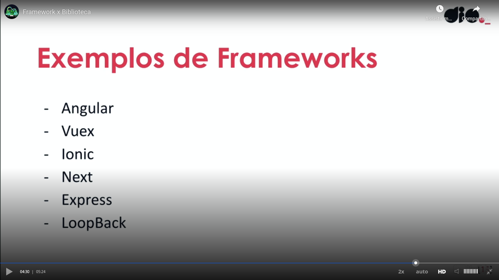
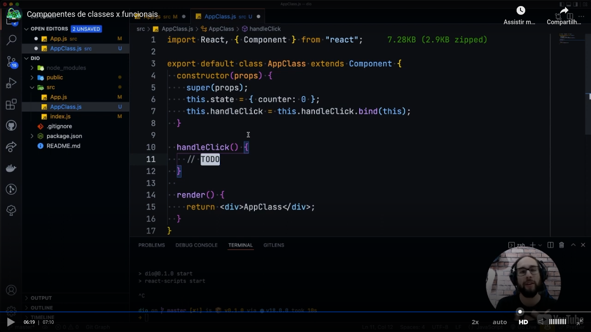
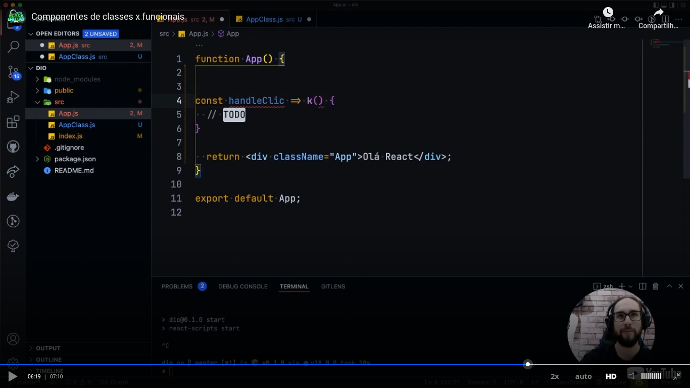
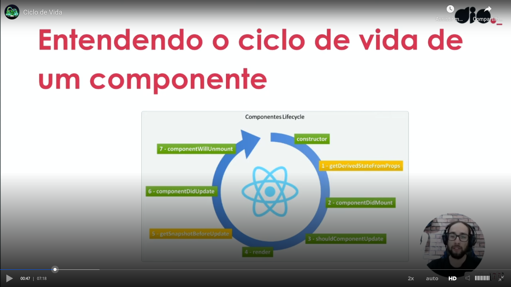

# General

React is a library and not a framework. Examples of frameworks:

I generated a project with the command `npx create-react-app` first project and the content was generated in the "first project" directory (under the root directory).

In [this video](https://youtu.be/QN-DKvbE94Y) I comment the generated content.

I thing that I forgot to comment in the video was that build "first-project\build" directory was generated with the command `npm run build`.

# Class component x function component

# Component creating

I created and used a component as I explained [in this video](https://youtu.be/HBlFcto9LiU).

# Component lifecycle

